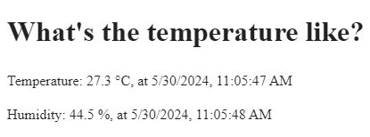

# IoT Console



## Description

Displays the temperature and humidity data from a Firebase realtime database instance on a Firebase-hosted website.

## Building

```bash
$ npm install
$ firebase login
$ firebase init
$ firebase deploy
```
